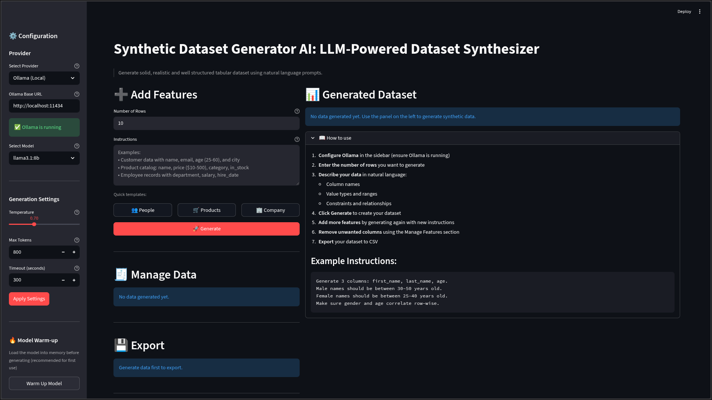

<div align="center">

# Synthetic Data Generator AI

**Generate realistic synthetic datasets using natural language prompts powered by LLMs**

[](https://python.org)
[](https://streamlit.io)
[](https://hub.docker.com/r/familorujov/synthetic-data-generator-ai)
[](LICENSE)

<br>

*Describe your data in plain English and get structured datasets instantly*

[Quick Start](#quick-start) • [Features](#features) • [Architecture](#architecture) • [Documentation](#documentation)

</div>

---

## What is This?

A Streamlit-based tool that generates realistic tabular data using LLMs. Instead of writing scripts or using random generators, just describe what you need:

```
"Customer data with name, email, age 25-60, and US city"
```

And get a clean pandas DataFrame ready to use.

<div align="center">
  
  <p><em>Main application interface with dark theme</em></p>
</div>

## Features

| Feature | Description |
|---------|-------------|
| **Natural Language** | Describe your data in plain English |
| **Multi-Provider** | Ollama, OpenAI, Gemini, Anthropic, Groq |
| **Smart Generation** | Add columns incrementally to existing data |
| **Full Control** | Remove rows/columns, toggle index, export CSV |
| **Docker Ready** | One command deployment |

## Quick Start

### Option 1: Docker (Recommended)

```bash
# Pull and run
docker pull familorujov/synthetic-data-generator-ai:latest
docker run -p 8501:8501 familorujov/synthetic-data-generator-ai:latest

# Or use docker compose
docker compose up
```

Open http://localhost:8501 in your browser

### Option 2: Local Installation

```bash
# Clone the repository
git clone https://github.com/FamilOrujov/synthetic-data-generator-ai.git
cd synthetic-data-generator-ai
```

**Using uv (recommended):**
```bash
uv sync
uv run streamlit run app.py
```

**Using pip and venv:**
```bash
python -m venv venv
source venv/bin/activate  # On Windows: venv\Scripts\activate
pip install -r requirements.txt
streamlit run app.py
```

**Using pip directly:**
```bash
pip install -r requirements.txt
streamlit run app.py
```

## Architecture

```
┌─────────────────────────────────────────────────────────────────┐
│                         Streamlit UI                            │
│                          (app.py)                               │
└─────────────────────────────┬───────────────────────────────────┘
                              │
                              ▼
┌─────────────────────────────────────────────────────────────────┐
│                      DataGenerator                              │
│                  (src/data_generator.py)                        │
│  • Builds prompts from user instructions                        │
│  • Parses JSON responses into DataFrames                        │
│  • Normalizes array lengths for consistency                     │
└─────────────────────────────┬───────────────────────────────────┘
                              │
                              ▼
┌─────────────────────────────────────────────────────────────────┐
│                      LLM Client Layer                           │
│                       (src/llm.py)                              │
├─────────────┬─────────────┬─────────────┬───────────┬───────────┤
│   Ollama    │   OpenAI    │   Gemini    │ Anthropic │   Groq    │
│   (local)   │   (cloud)   │   (cloud)   │  (cloud)  │  (cloud)  │
└─────────────┴─────────────┴─────────────┴───────────┴───────────┘
```

### Core Components

| Component | File | Purpose |
|-----------|------|---------|
| **UI Layer** | `app.py` | Streamlit interface, user interactions, session state |
| **Generator** | `src/data_generator.py` | Core logic: prompt building, response parsing, DataFrame creation |
| **LLM Clients** | `src/llm.py` | Provider-specific API integrations with unified interface |
| **Utilities** | `src/utils.py` | JSON extraction, array normalization, CSV export |

## Documentation

### Usage Guide

#### Initial Setup

1. **Select Provider**
   - Choose from Ollama (local), OpenAI, Gemini, Anthropic, or Groq
   - For Ollama: Ensure it's running locally (`ollama serve`)
   - For cloud providers: Have your API key ready

2. **Configure Connection**
   - Enter API key for cloud providers (stored in session only, never saved)
   - For Ollama: Verify the base URL matches your setup
   - Select your preferred model from the dropdown

3. **Adjust Generation Settings**
   - Set Temperature (0.7 recommended for balanced output)
   - Set Max Tokens (800 default, increase for large datasets)
   - Set Timeout (300 seconds default, increase for slow connections)
   - Click "Apply Settings" to initialize the connection

4. **Optional: Warm Up Model** (Ollama only)
   - Click "Warm Up Model" to load it into memory
   - This prevents delays on first generation
   - Recommended for better user experience

#### Generating Data

5. **Specify Dataset Size**
   - Enter number of rows (e.g., 10, 50, 100)
   - This locks after first generation to maintain consistency

6. **Describe Your Data**
   - Write natural language instructions in the text area
   - Or use quick templates (People, Products, Company)
   - Be specific about columns, types, ranges, and relationships

7. **Generate Dataset**
   - Click "Generate" button
   - Wait for LLM to process (usually 5-30 seconds)
   - Generated data appears in the right panel

8. **Add More Columns** (Optional)
   - Enter new instructions describing additional columns
   - Click "Generate" again
   - New columns are appended while preserving existing data

#### Managing Data

9. **Remove Unwanted Columns**
   - Select columns from the multiselect dropdown
   - Click "Remove Columns"

10. **Remove Specific Rows**
    - Select row numbers to delete
    - Click "Remove Rows"

11. **Toggle Index Display**
    - Check/uncheck "Show Index Column" to control visibility

#### Exporting Results

12. **Export to CSV**
    - Click "Export to CSV" to save locally with auto-incrementing filename
    - Or use "Download CSV" for direct browser download
    - Files include all visible data without index (unless shown)

#### Troubleshooting

**"Generation failed: Failed to parse LLM response as valid JSON"**
- Increase Max Tokens (try 1200-1600)
- Simplify your instructions
- Try a different model
- For Ollama: Ensure model is fully loaded

**"Request timed out"**
- Increase Timeout setting
- Reduce number of rows
- Use a faster model or provider

**"Ollama is not running"**
- Start Ollama: `ollama serve`
- Check base URL is correct
- Verify Ollama is installed

**Poor quality data**
- Increase Temperature for more variety
- Be more specific in instructions
- Try a more capable model
- Add explicit constraints and examples

### Example Prompts

#### Simple Examples
```
Customer database with first_name, last_name, email, age 25-65, city

Product catalog: name, price ($10-500), category, stock quantity, rating 1-5

Employee records: name, department, job_title, salary, years_employed
```

#### Advanced Examples with Constraints
```
Generate 3 columns: first_name, last_name, age.
Male names should be between 30-50 years old.
Female names should be between 25-40 years old.
Make sure gender and age correlate row-wise.
```

```
E-commerce transaction data: customer_id (UUID format), order_date (last 90 days),
product_category (Electronics, Clothing, Home, Books), quantity (1-5),
unit_price ($10-200), total_amount (calculated from quantity * unit_price)
```

```
Healthcare patient data: patient_id, admission_date, diagnosis (common conditions),
age (18-90, realistic distribution), treatment_duration_days (1-30),
insurance_provider (5 major companies), copay_amount ($0-500)
```

#### Tips for Better Results

**Be Specific:**
- Instead of "age", use "age between 25 and 60"
- Instead of "price", use "price in dollars between 10 and 500"
- Instead of "date", use "date within last 30 days"

**Define Relationships:**
- "Email should match the first and last name"
- "Total should equal quantity multiplied by price"
- "End date must be after start date"

**Specify Formats:**
- "Phone numbers in format (XXX) XXX-XXXX"
- "Dates in YYYY-MM-DD format"
- "Currency values with 2 decimal places"

**Use Realistic Distributions:**
- "Most ages around 30-40, fewer at extremes"
- "Prices weighted toward lower values"
- "Occasional missing values (5-10%)"

### Configuration Parameters

#### Provider Settings

| Parameter | Description | Notes |
|-----------|-------------|-------|
| **Provider** | LLM service to use | Options: Ollama (local), OpenAI, Gemini, Anthropic, Groq |
| **API Key** | Authentication key for cloud providers | Not required for Ollama. Keep this secure and never commit to version control |
| **Ollama Base URL** | Endpoint for local Ollama instance | Default: `http://localhost:11434`. Change if running Ollama on different host/port |
| **Model** | Specific model to use for generation | Available models depend on selected provider. Ollama models must be pulled first |

#### Generation Settings

| Parameter | Description | Range | Default | Impact |
|-----------|-------------|-------|---------|--------|
| **Temperature** | Controls randomness and creativity | 0.0 - 2.0 | 0.7 | Lower (0.0-0.5): More consistent, deterministic output. Higher (0.8-2.0): More creative, varied results. Use lower for structured data, higher for diverse examples |
| **Max Tokens** | Maximum length of LLM response | 100 - 4000 | 800 | Limits how much data can be generated per request. Increase for larger datasets or more columns. 800 tokens typically handles 50-100 rows with 5-10 columns |
| **Timeout** | Maximum wait time for LLM response | 60 - 600 seconds | 300 | Increase if experiencing timeout errors with large datasets or slow models. Local Ollama models may need higher timeouts on first load |

#### Data Generation Parameters

| Parameter | Description | Behavior |
|-----------|-------------|----------|
| **Number of Rows** | How many data records to generate | Once data is generated, this locks to maintain consistency when adding columns. Reset the dataset to change row count |
| **Instructions** | Natural language description of desired data | Be specific about column names, data types, ranges, and relationships. Example: "age between 25-60" or "email addresses matching first and last names" |

### Supported LLM Providers

| Provider | Available Models | Setup | Best For | Notes |
|----------|-----------------|-------|----------|-------|
| **Ollama** | llama3.1, llama3.3, mistral, codellama, etc. | Install from [ollama.ai](https://ollama.ai), run `ollama pull llama3.1` | Privacy-focused users, offline work, no API costs | Completely local, no internet required. Performance depends on hardware. First generation may be slow while model loads into memory |
| **OpenAI** | gpt-4o, gpt-4o-mini, gpt-4.1, o1, o3-mini | Get API key from [platform.openai.com](https://platform.openai.com) | High-quality, consistent results | Best overall quality. Pay-per-use pricing. Fast response times |
| **Gemini** | gemini-2.0-flash, gemini-1.5-pro, gemini-1.5-flash | Get API key from [makersuite.google.com](https://makersuite.google.com) | Cost-effective, good free tier | Generous free quota. Good balance of speed and quality |
| **Anthropic** | claude-sonnet-4-5, claude-haiku-4-5, claude-opus-4-5 | Get API key from [console.anthropic.com](https://console.anthropic.com) | Complex instructions, structured output | Excellent at following detailed specifications. Strong reasoning capabilities |
| **Groq** | llama-3.3-70b, llama-3.1-8b, qwen3-32b | Get API key from [console.groq.com](https://console.groq.com) | Speed-critical applications | Extremely fast inference. Free tier available. Uses open-source models |

#### Provider Selection Guide

**Choose Ollama if:**
- You need complete data privacy (everything stays local)
- You want to avoid recurring API costs
- You have decent hardware (8GB+ RAM recommended)
- You don't need internet connectivity

**Choose OpenAI if:**
- You need the highest quality synthetic data
- Budget is not a primary concern
- You want consistent, reliable outputs

**Choose Gemini if:**
- You're prototyping or testing
- You want good quality with generous free tier
- You need a balance between cost and performance

**Choose Anthropic if:**
- Your instructions are complex with many constraints
- You need data with intricate relationships
- You want reliable structured output

**Choose Groq if:**
- Speed is critical for your workflow
- You want free access to capable models
- You need to generate data quickly at scale

### Programmatic Usage

You can use the core components directly without the UI:

```python
from src.llm import create_llm_client
from src.data_generator import DataGenerator
import pandas as pd

# Create client
client = create_llm_client(
    provider="openai",
    model="gpt-4o",
    api_key="your-api-key"
)

# Generate data
generator = DataGenerator(client)
df = generator.generate_features(
    instructions="Customer data: name, email, age 25-60",
    n_rows=50,
    existing_dataframe=pd.DataFrame()
)

print(df.head())
```

## Project Structure

```
├── app.py                  # Streamlit UI application
├── src/
│   ├── __init__.py         # Package exports
│   ├── llm.py              # LLM client implementations (Ollama, OpenAI, etc.)
│   ├── data_generator.py   # Core generation logic & prompt engineering
│   └── utils.py            # Helper functions (JSON parsing, normalization)
├── requirements.txt        # Python dependencies (pip/venv)
├── pyproject.toml          # Project metadata and dependencies (uv)
├── Dockerfile              # Container configuration
└── docker-compose.yml      # One-command deployment
```

