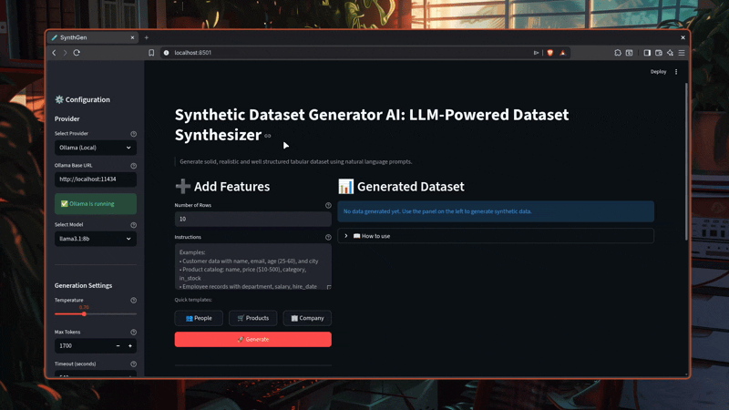

<div align="center">

# Synthetic Data Generator AI

**Generate realistic synthetic datasets using natural language prompts powered by LLMs**

[](https://python.org)
[](https://streamlit.io)
[](https://hub.docker.com/r/familorujov/synthetic-data-generator-ai)

<br>



*Describe your data in plain English and get structured datasets instantly*

[Quick Start](#quick-start) | [Features](#features) | [Architecture](#architecture) | [Documentation](#documentation)

</div>

---

## Why I Built This

I developed the Synthetic Data Generator AI to address a distinct challenge in the software development lifecycle. I frequently encountered situations where I needed high quality structured data for testing and prototyping. I found that writing manual scripts for every new schema was inefficient and brittle. I realized that by leveraging the semantic understanding of Large Language Models I could create a system that understands vague requirements and produces precise tabular data. I wanted to build a tool that empowers developers to generate complex datasets without writing a single line of generation logic.

## How It Works

I architected this application to function as a bridge between natural language and structured DataFrames. I chose Streamlit for the frontend to ensure a responsive and interactive user experience. I implemented the backend logic in Python where I orchestrated the interaction between the user prompts and the LLM providers.

I designed the core system to construct dynamic prompts that enforce strict JSON output formats. I parse these outputs and convert them into Pandas DataFrames. I also implemented a normalization layer to handle potential inconsistencies in the LLM output ensuring that every generated row matches the requested schema.

## Features

I prioritized flexibility and control in the feature set.

### Natural Language Processing
I enable users to describe their data needs in plain English. I parse these instructions to understand column names data types and constraints.

### Multi Provider Support
I integrated multiple LLM providers including Ollama for local execution and OpenAI Gemini Anthropic and Groq for cloud based generation. I did this to give users the choice between privacy cost and performance.

### Smart Generation
I implemented a context aware generation engine. I allow users to add new columns to an existing dataset where the model understands the context of the previous data to ensure consistency.

### Docker Integration
I containerized the entire application to ensure that it can be deployed with a single command. I wanted to eliminate environment configuration issues for new users.

## Quick Start

I provide two main methods to run the application. I recommend using Docker for the most seamless experience.

### Option 1: Docker (Recommended)

```bash
# Pull and run
docker pull familorujov/synthetic-data-generator-ai:latest
docker run -p 8501:8501 familorujov/synthetic-data-generator-ai:latest

# Or use docker compose
docker compose up
```

Open `http://localhost:8501` in your browser

### Option 2: Local Installation

```bash
# Clone the repository
git clone https://github.com/FamilOrujov/synthetic-data-generator-ai.git
cd synthetic-data-generator-ai
```

**Using uv (recommended):**
```bash
uv sync
uv run streamlit run app.py
```

**Using pip and venv:**
```bash
python -m venv venv
source venv/bin/activate  # On Windows: venv\Scripts\activate
pip install -r requirements.txt
streamlit run app.py
```

## Architecture

I structured the project to maintain a separation of concerns between the UI logic and the generation engine.

```
┌─────────────────────────────────────────────────────────────────┐
│                         Streamlit UI                            │
│                          (app.py)                               │
└─────────────────────────────┬───────────────────────────────────┘
                              │
                              ▼
┌─────────────────────────────────────────────────────────────────┐
│                      DataGenerator                              │
│                  (src/data_generator.py)                        │
│  • Builds prompts from user instructions                        │
│  • Parses JSON responses into DataFrames                        │
│  • Normalizes array lengths for consistency                     │
└─────────────────────────────┬───────────────────────────────────┘
                              │
                              ▼
┌─────────────────────────────────────────────────────────────────┐
│                      LLM Client Layer                           │
│                       (src/llm.py)                              │
├─────────────┬─────────────┬─────────────┬───────────┬───────────┤
│   Ollama    │   OpenAI    │   Gemini    │ Anthropic │   Groq    │
│   (local)   │   (cloud)   │   (cloud)   │  (cloud)  │  (cloud)  │
└─────────────┴─────────────┴─────────────┴───────────┴───────────┘
```

### Core Components

I organized the codebase into specific modules to handle different aspects of the application.

#### UI Layer (`app.py`)
I use this file to manage the Streamlit interface user session state and interaction flow.

#### Generator (`src/data_generator.py`)
I placed the core business logic here. I handle the prompt construction response parsing and DataFrame validation.

#### LLM Clients (`src/llm.py`)
I implemented a unified interface for all LLM providers in this module. I ensure that switching between OpenAI and Ollama is seamless for the rest of the application.

#### Utilities (`src/utils.py`)
I included helper functions here for JSON extraction and data normalization tasks.

## Documentation

### Usage Guide

I designed the interface to be self explanatory but here is the standard workflow I recommend.

### Step 1: Select Provider
I suggest starting with Ollama if you prefer local execution. I require users to provide API keys for cloud providers which I store only in the session state for security.

### Step 2: Configure Connection
I provided settings to adjust the Temperature and Max Tokens. I recommend a temperature of 0.7 for a balance between creativity and structure.

### Step 3: Generate Data
I allow users to describe the dataset size and the specific columns they need. I lock the row count after the initial generation to ensure subsequent columns align correctly.

### Step 4: Export Results
I included an export function that allows users to download the generated dataset as a CSV file.

### Programmatic Usage

I also designed the backend to be usable without the UI. I expose the core classes for programmatic access.

```python
from src.llm import create_llm_client
from src.data_generator import DataGenerator
import pandas as pd

# Create client
client = create_llm_client(
    provider="openai",
    model="gpt-4o",
    api_key="your-api-key"
)

# Generate data
generator = DataGenerator(client)
df = generator.generate_features(
    instructions="Customer data: name, email, age 25 to 60",
    n_rows=50,
    existing_dataframe=pd.DataFrame()
)

print(df.head())
```

## Project Structure

I organized the project files as follows.

```
├── app.py                  # Streamlit UI application
├── src/
│   ├── __init__.py         # Package exports
│   ├── llm.py              # LLM client implementations
│   ├── data_generator.py   # Core generation logic
│   └── utils.py            # Helper functions
├── requirements.txt        # Python dependencies
├── pyproject.toml          # Project metadata
├── Dockerfile              # Container configuration
└── docker-compose.yml      # Deployment configuration
```
